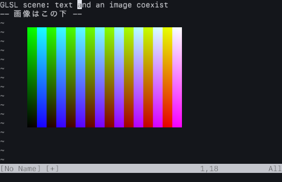
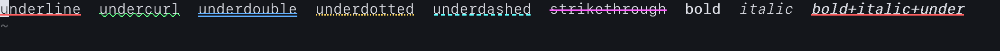

# neovim-glsl

Neovim の画面を GLSL で描く実験。

Neovim 本体には手を入れていない。`nvim --embed` として動かし、編集エンジンはそのまま
Neovim が担当する。このプログラムが持つのは画面と入力だけで、Neovim から送られてくる
画面情報を OpenGL / GLSL で描画する。



## 動くもの

このスクリーンショットの文字はすべて実際に打ち込んだもので、画像は Neovim 内の Lua が
配置したもの。以下は実機（Apple M4 Max / macOS 26 / Neovim 0.11.5）で確認済み。

- 実際の Neovim の画面が GLSL 経由で出る。行番号、ステータスライン、コマンドライン、
  ハイライト色、カーソルの反転表示
- 文字属性。太字・斜体（フォントに専用の face が無いので合成）、下線 5 種
  （`underline` / `undercurl` / `underdouble` / `underdotted` / `underdashed`）、
  取り消し線。色は nvim の `sp` に従い、無ければ文字色を継ぐ
- 日本語の表示。フォントに無い字は字形単位で別フォントへ落ちる
- IME。かな入力の未確定文字列がその場に出て、確定した文字列だけが Neovim に渡る
- 画像とテキストが同じ画面に共存する。Neovim 側の Lua から位置を指定して置ける
- キーボード入力
- `.app` として組む
- aish の read-only structured surface（discovery / status / typed object inspection）
- Mac → Zeno と multi-target 方向を実測する platform report
- Root-ui 統合仮説を検証する machine-readable grid projection

文字属性は実機の snapshot で確認した。下線 5 種はいずれも同じ quad で描いており、
undercurl は正弦を刻んだ波、点線・破線は絶対 x に位相を合わせてあるので、同じ
highlight が続く間は cell 境界で模様が途切れない。



再現するコマンド（`evaluation/candidate-embed-opengl` から）:

```bash
./target/debug/nvimgl --snapshot ../evidence/text-attributes.png \
  --cols 111 --rows 3 --lua "$(cat ../evidence/text-attributes.lua)" -- --clean
```

## 動かないもの

実験段階なので足りていないものは多い。

- ウィンドウ分割（`ext_multigrid` 未対応）
- 補完メニュー、コマンドライン、メッセージの外部描画
- 動画。表示のしくみは画像と同じだが、デコードは実装していない
- 性能は測っていない

## 使い方

必要なもの: Neovim 0.11 以降、Rust（rustup）、macOS。

```bash
cd evaluation/candidate-embed-opengl
cargo build
./target/debug/nvimgl -- --clean
```

Mac アプリとして組む場合:

```bash
./make-app.sh
open nvimgl.app
```

画面を PNG に書き出すモードもある。ウィンドウを見なくても結果を確認できる。

```bash
./target/debug/nvimgl --snapshot /tmp/shot.png --input 'ihello<Esc>' -- --clean
```

Neovim 内の Lua から画像を置く:

```lua
vim.rpcnotify(1, 'nvimgl_image', '/path/to/image.png', 3, 6, 34, 11)
-- 引数は パス, 行, 列, 幅（文字数）, 高さ（行数）
```

### aish を混ぜる

`aish-nu` の場所を明示して起動する:

```bash
./target/debug/nvimgl --aish /path/to/ai-native-shell/aish-nu -- --clean
```

Neovim 内で `:AishDiscover`、`:AishStatus`、
`:AishInspect repository /path/to/repository` が使える。
結果は JSON の scratch buffer に開く。現段階は read-only で、`aish run` / `aish exec`
は公開しない。destructive / external change の確認 UI が未決なまま実行経路を足すと、
aish の effect gate を迂回しかねないため。

### platform / Root-ui 評価を記録する

```bash
./target/debug/nvimgl \
  --snapshot /tmp/nvimgl.png \
  --platform-report /tmp/nvimgl-platform.json \
  --root-ui-evaluation /tmp/nvimgl-root-ui.json \
  -- --clean
```

platform report は実行中の OS・architecture・GL/GLSL・Neovim を記録し、Macを第一段、
Zenoを次の評価、全体を multi-target 方向として残す。Root-ui projection は現行 grid を
機械可読にするが、Root-ui 採用や visual/editor ownership を決定しない。

### macOS での注意

Homebrew の `rustc` は環境によって起動時に落ちる（libLLVM の ABI 不整合）。その場合は
rustup のツールチェインを PATH の先頭に置く。cargo は `rustc` を PATH から探すので、
cargo をフルパスで指定するだけでは足りない。

```bash
export PATH="$HOME/.rustup/toolchains/stable-aarch64-apple-darwin/bin:$PATH"
```

Finder から `.app` を起動した場合は shell の `PATH` を引き継がない。nvimgl は
`NVIMGL_NVIM`、現在の `PATH`、各 OS の一般的な配置の順に Neovim を探索する。
独自の場所へ入れた場合は `NVIMGL_NVIM=/absolute/path/to/nvim` を使う。

ターミナルから直接起動するとウィンドウが前面に来ないことがあり、その状態では IME が
起動しない。`open nvimgl.app` を使うか、ウィンドウをクリックする。

## 状態

実験プロトタイプであり、完成品ではない。構成の選択（Neovim をどう繋ぐか、どの
グラフィックス API を使うか、どこまでを GLSL で描くか）はまだ確定しておらず、
`evaluation/` 以下はそれを判断するために実際に動かして測ったもの。

未決の設計判断は [UNDECIDED.md](UNDECIDED.md) に、開いている選択肢は
[DESIGN-SPACE.md](DESIGN-SPACE.md) に置いてある。
