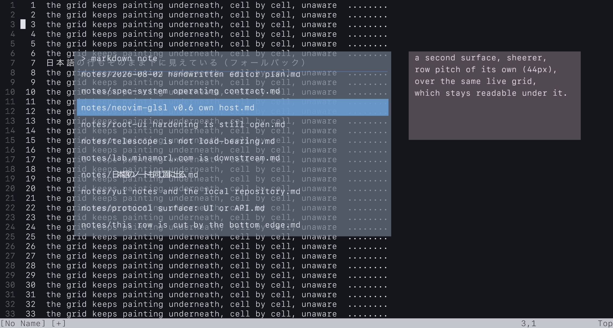

# free-surface — evidence, not a decision

This directory measures what a surface can do when it stops speaking in cells.

It exists for two open questions in the spec:

- `open_question neovim_glsl.navigation_surface_decision`
- `quarantine neovim_glsl.external_surface_boundary`

It answers neither. `navigation_mechanism_selection`, `navigation_surface_decision`
and `external_surface_boundary` all remain open after this measurement, and
nothing here is wired to a key, a matcher or a file list. What is here is the
*surface* a picker would need, drawn and counted.

## Why this is worth measuring at all

Every other thing this program draws is addressed in cells. A glyph lands at
`col * cell_w`, a row occupies exactly `cell_h`, and a thing that wants to sit
one third of a row lower has nowhere to sit. That is not a limitation of GLSL.
It is a limitation of speaking in a terminal's coordinates, and it is inherited
by anything that draws itself *into the grid* — including a picker written as a
Neovim plugin, however good it is.

So the question underneath "does navigation have to be telescope" is really:
is the grid the only place a surface can live? This measures the alternative.

## What was drawn

`panels.json` describes two surfaces in pixels. `bed.lua` fills the editor
underneath with ordinary numbered lines, including a Japanese one, and knows
nothing about panels — the grid keeps painting, unaware it is being covered.

```bash
cd ../candidate-embed-opengl
cargo run -- --cols 120 --rows 34 \
  --snapshot ../free-surface/out/free-surface-over-grid.png \
  --panels ../free-surface/panels.json \
  --panel-report ../free-surface/out/measurement.json \
  --lua "$(cat ../free-surface/bed.lua)" -- --clean
```



The panels go through the *same* shader, the same vertex format and the same
atlas as the grid, appended to the same draw call. There is no second renderer:
`Renderer::push_panels` adds quads to the stream `build_scene` just filled.

## What the grid cannot express, observed

Measured on Apple M4 Max / macOS 26 / OpenGL 4.1 Metal - 90.5 / GLSL 4.10, at a
2280x1224 framebuffer. Raw counts in `out/measurement.json`.

| observation | panel 0 | panel 1 |
|---|---|---|
| origin | `(275.5, 192.25)` | `(1520.25, 192.25)` |
| origin sits off the cell raster | yes | yes |
| row pitch | 62.5 px | 44 px |
| backdrop alpha | 0.62 | 0.32 |
| quads emitted | 361 | 93 |
| quads cut at an edge | 59 | 0 |
| rows visible | 11 | 4 |
| first row cut by | 23.5 px | 0 px |
| last row cut by | 49.5 px | 0 px |

Cell height on this run is 36 px and cell width 19 px, so:

- **Fractional origin.** `192.25` is not a multiple of 36. A cell-addressed
  surface would have to round it to a row; this one does not.
- **Independent pitch.** 62.5 px and 44 px are both unrelated to 36 px, and the
  two panels disagree with each other as well as with the grid.
- **Fractional scroll.** The body is scrolled 23.5 px, so the first visible row
  is cut partway through its glyphs. A grid's only legal answers are 0 and one
  whole row.
- **Translucency over live text.** A cell holds one background colour and no
  opacity. These panels hold both, and the editor text stays legible through
  them.
- **Sub-cell clipping.** 59 quads met an edge and were cut, with their texture
  coordinates cut by the same proportion, so half a quad shows half a glyph
  rather than a squeezed whole one.

## Verifying it

`verify.py` reads the PNG back and checks the three claims that matter, against
pixels rather than against this prose:

```bash
python3 verify.py
```

```text
grid background outside every panel: (20, 22, 27)

panel 0: origin (275.5, 192.25) size 1180.0x690.0 alpha 0.62
  dominant interior colour: (30, 38, 56) (144854 samples)
  blend of (36, 48, 73) at 0.62 over (20, 22, 27) predicts (30, 38, 56); opaque would be (36, 48, 73)
  top edge in the image: row 192, coordinate asked for 192.25

grid text outside the panel: (224, 226, 234)
through panel 0 it should read (107, 116, 134); matching pixels inside: 1170

ok: backdrops blend, origins sit off the cell raster, grid text shows through
```

The blend arithmetic is the load-bearing part. If the panel had *replaced* what
was under it, the interior would read as `(36, 48, 73)` exactly. It reads as the
mix, which is only possible because the surface is composited rather than
written into cells.

`src/panel.rs` carries 11 unit tests covering the same laws without a GPU:
fractional origin survival, proportional UV rescaling on clip, fractional
scroll, row pitch independence, right-edge cutting, and determinism of the
emitted geometry.

## What this does not measure

- **Performance.** No timing is quoted. The live-session recorder observes two
  frames on a snapshot run, which is not a sample, and the deterministic bench
  does not drive panels. Measuring this properly needs its own harness.
- **Interaction.** No key handling, no matcher, no source, no action. This is a
  surface, not a picker.
- **Where the surface should live.** Grid-internal, an overlay in the same
  window (what this does), a separate OS window, or a separate process are all
  still open under `quarantine neovim_glsl.external_surface_boundary`.
- **Whether GLSL's advantage was "used".** There is no threshold for that, which
  is why `quarantine neovim_glsl.glsl_advantage_criterion` exists. What is
  recorded above is a list of expressible things, not a verdict.

## Files

- `panels.json` — the two surfaces, in pixels.
- `bed.lua` — the editing session underneath. Knows nothing about panels.
- `verify.py` — reads the PNG back and checks the claims.
- `out/free-surface-over-grid.png` — the snapshot.
- `out/measurement.json` — what the panel pass emitted, counts only.
