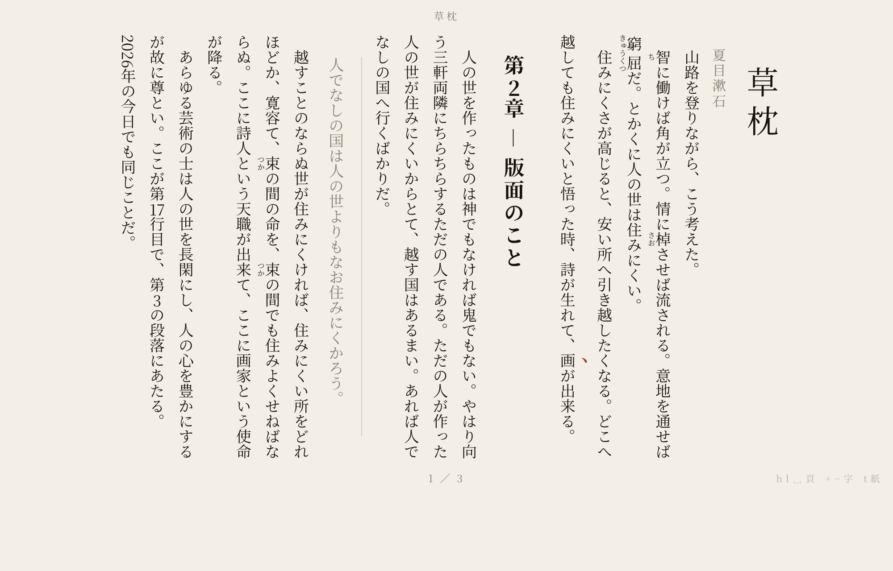

# host — the own host

The architecture `spec neovim-glsl@0.6` selected is **own host speaking Neovim
protocol** (`pin architecture_choice`). Until now this repository held evidence
for that choice and no implementation of it. This directory is the
implementation.

There is no Neovim process. The editing core is here, and what used to sit at
the far end of `nvim --embed` now sits at the far end of a pipe inside this
program.

```
┌──────────────────────────────┐        ┌───────────────────────────────┐
│ editing core                 │        │ UI client                     │
│  buffer · motions · operators│msgpack │  screen model                 │
│  registers · undo · `:` line │◀──────▶│  GLSL grid renderer           │
│  Neovim protocol server      │  pipe  │  root-ui navigation surface   │
└──────────────────────────────┘        └───────────────────────────────┘
```

The two halves meet **only** over encoded msgpack. That is not decoration: the
same server also answers on stdin/stdout (`--embed`), so "speaks the Neovim
protocol" is checkable from outside the program rather than asserted from
inside it. `tests/protocol_face.rs` runs the built binary as a separate process,
attaches with `nvim_ui_attach`, types, and reads the text back out of the
`redraw` stream.

## Running it

```bash
export PATH="$HOME/.rustup/toolchains/stable-aarch64-apple-darwin/bin:$PATH"
cd host
cargo build
./target/debug/nvimglsl                    # a scratch note
./target/debug/nvimglsl path/to/note.md
```

Write a frame to a PNG instead of opening a window:

```bash
./target/debug/nvimglsl README.md --snapshot /tmp/shot.png --input 'GO# a new line<Esc>'
```

Serve the protocol to some other UI client, the way `nvim --embed` does:

```bash
./target/debug/nvimglsl --embed
```

## Keys

The baseline is the owner's existing keymap (`pin keymap_preservation`), so
nothing here is a new key language:

- motions `h j k l w W b B e E 0 ^ $ gg G { } f t F T %`, counts, `<C-d>/<C-u>/<C-f>/<C-b>`, `zz/zt/zb`
- operators `d c y > <` times any motion, doubled (`dd`, `cc`, `yy`, `>>`), and in visual mode
- `i a I A o O x X s S D C r J ~ p P u <C-r> v V n N`
- registers `"a` … `"z`, `:w :wq :q :q! :e :s/// :%s///g :noh`, `/` and `?`

Additions, all of them because the primary object is a markdown note:

| key | what |
| --- | --- |
| `<Space>o`, `<Space>n`, `:Notes` | navigate the note vault |
| `<Space>f`, `:Files` | navigate the working tree instead |
| `gf` | follow the `[[wiki link]]` under the cursor |
| `:Note <title>` | create a note in the vault and open it |
| `<Space>p`, `:Tategaki` | set the note as a vertical page and open it |

## The navigation surface is root-ui

`pin navigation_locus_choice` puts the picker outside the terminal grid, in the
same window and the same process, drawn in GLSL by the host. `src/root_ui/` is a
port of root-ui's design-language phases — semantic input → layout → non-colour
decoration → user-owned colour — and `src/root_ui/adapter.rs` is a shader
adapter for them, beside the WebGL2 and WebGPU adapters root-ui already ships.

What the port buys over a hand-drawn panel is the separation the phases enforce:
layout is frozen before decoration exists, decoration before any colour is
chosen. `--scheme light` rebinds colour onto the *same* resolved layout;
`flat_scene_layout_identity` is equal across both schemes, and a test says so.

Corners are materialized in physical pixels from the shorter side, so they stay
circular when the window is resized, and the panel origin is deliberately off
the cell raster — a surface that could only be placed on cell boundaries would
be a floating window in the grid, which `pin navigation_not_in_grid` rejects.

## The vertical preview is set in CSS

`pin primary_object` makes a markdown note the thing being edited. A first-class
object that can only be *edited* is half implemented, so `<Space>p` sets the
buffer as a vertical Japanese page — ruby, kenten, tate-chu-yoko, strict kinsoku,
mincho — and hands it to whatever the machine opens HTML with.



**No typesetting engine is written here.** `assets/tategaki.css` is the
typesetting, and the engine reading it does the work: CSS Writing Modes'
`writing-mode: vertical-rl`, `text-orientation`, `text-combine-upright`, `ruby`,
`line-break: strict` and `hanging-punctuation` are the same path electronic books
actually travel, with mincho metrics, line breaking and punctuation compression
already implemented. `src/tategaki/` only lowers markdown into elements that mean
something, and owns the three judgements the engine does not make:

- **Ruby** has no markdown syntax, so it is read in the Aozora Bunko notation
  (`｜base《reading》`, and `《》` after a run of kanji).
- **Kenten** come from `*emphasis*`, because Japanese emphasis is sesame dots and
  a vertical italic is not typesetting.
- **Tate-chu-yoko** is decided here and wrapped in a span, because no engine
  implements `text-combine-upright: digits`. One and two digits stand upright;
  longer runs stay sideways, which is how vertical text is set.

The page dimensions live in `:root` in the stylesheet and `src/tategaki/style.rs`
copies them. A test reads the stylesheet and fails if the copy drifts, so there
is never a question of which one is true.

A page turn moves by the whole lines the reading area holds, so a page boundary
always lands on a line boundary. The reading area itself stops growing at
`--tategaki-page` and sits centred, the way a book does on a desk.

Inside the page: `h`/`l` or space turn, `g`/`G` reach the ends, `+`/`-` resize
the type, `t` swaps paper for night. A reading view is paper even when the editor
is dark, because what it imitates is a book; `--scheme` moves it.

`<Space>p` is a builtin mapping, so it yields to whatever the owner's `init.lua`
binds there, exactly as `<Space>o` does — `pin keymap_preservation` makes the
owner's keymap the baseline, not this one. `:Tategaki` is always reachable.

Writing the page without opening anything needs no window and no GL:

```bash
./target/debug/nvimglsl evaluation/evidence/tategaki-sample.md --tategaki /tmp/page.html
```

`:Tategaki` sets the page from the **buffer**, not from the file on disk — the
point of a preview is seeing what has not been saved yet.

## Notes are the primary object

`pin primary_object` makes a markdown note the thing being edited,
`pin note_substrate` makes the substrate the existing yui notes, and
`pin note_substrate_not_new` forbids inventing a second store. yui already
mirrors `yui_notes` into a local markdown vault and syncs it back, so that vault
*is* the local half of `pin storage_model`'s local-repository-and-DB pair.

`src/notes.rs` opens it — `$OBSIDIAN_VAULT_PATH`, defaulting to
`~/repos/obsidian`, both of which are yui's own. It defines no note format, no
database and no sync protocol; any of those would be the second store the pin
forbids under a different name.

## What is not decided here

- **`open_question navigation_state_owner`** — the human gate answered
  「わからない」. The picker's state is held host-side because something must
  hold it for the surface to exist; the seam that keeps the other arrangement
  reachable is `picker::Source`, which the surface asks for rows and which a
  Neovim-side supplier could implement.
- **`open_question navigation_input_routing`** — while the surface is open the
  host takes the keys directly. Also an implementation standing inside an open
  axis.
- **`open_question protocol_surface_scope`** — the UI face is served in full;
  the API face is served only where the host needs it (`nvim_buf_get_lines`,
  `nvim_buf_set_lines`, `nvim_command`, `nvim_get_mode`). `nvim_exec_lua`
  answers with an error, because `free lua_runtime_presence` leaves a Lua
  runtime optional and this host has none — a `nil` would let a client believe
  its code ran.
- **`open_question embed_candidate_disposition`** — the grid renderer, glyph
  atlas, screen model and external-UI surfaces are the measured candidate's,
  reached by `#[path]` rather than copied. `evaluation/candidate-embed-opengl`
  is byte-for-byte what it was when it was measured.

## Tests

```bash
cargo test
```

383 tests: the editing core against vim's own behaviour (including the one
documented irregularity, `cw` acting like `ce`), the redraw stream, the root-ui
phases, the note vault, the owner's config and keymap, the window model, the
plugin host, the vertical page's document model and its stylesheet copy, and
eight that drive the binary from outside as a separate process.
